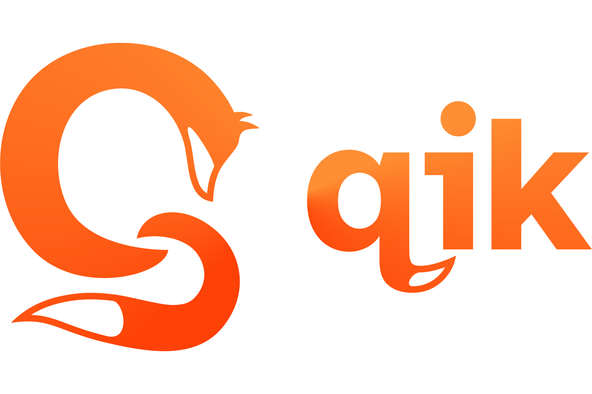

# Why QIK?
- Easy of use. QIK's design is heavily inspired by Lua to be really beginner friendly!
- Insane flexibility in user experience. One can define **own** keywords just the way it's desired!
- Easy to implement in your project. There's a single header to include!

# State
The project is currently in active development and things can rapidly change! If you want to rely on your code written in QIK, **please store the version of QIK the code was written for**!

# Dependencies
QIK depends on few std libs like `string.h`, `math.h` and `stdbool.h`.
It also uses a wonderful hashmap.c implemented in C which is included.

# Authors
- The QIK programing language was made with ❤️ by  **Filip Król** aka **MightyPancake**
- Logo made by a good friend of mine, **[Unsua Design](https://www.instagram.com/unsuadesign/)**
- The incredible hashmap implementation in C can be found here [hashmap.c](https://github.com/tidwall/hashmap.c)

